# 1. MySQL数据库

## 1.1 什么是数据库

存储数据的仓库。

常见的数据库: MySQL、 Oracle、 Sqlserver、 DB2等。


## 1.2 MySQL简介

MySQL是一个关系型数据库管理系统，由瑞典MySQL AB 公司开发，目前属于 Oracle 旗下产品 

数据表的结构和excel一模一样：

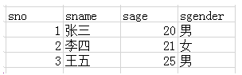


表结构:  

   和excel表的结构是一样的。
   每一列都是一类数据 --- 字段
   每一行代表一条数据 --- 记录

 

## 1.3 安装MySQL

> 之前，我们安装过一个集成软件PHPstudy，其实安装完它，我们的计算机上就已经安装好MySQL了，不必从新安装了。当然也可以单独安装MySQL，不过得去官网下载MySQL。

安装完MySQL，我们的计算机又变成服务器了，不过不是Web服务器，而是MySQL数据库服务器了。我们可以将数据存储到MySQL服务器中，让它帮我们将数据永久保存。

## 1.4 安装操作MySQL的图形化处理界面

其实操作MySQL不使用图形化界面，只使用命令行窗口也可以，但是操作起来不方便，所以我们安装一个图形化管理软件。

管理MySQL的图形化界面有很多:  Navicat、 Sqlyog、 phpmyadmin等等

课上，我们使用的是Nacicat。


1) 解压

2) 选择版本

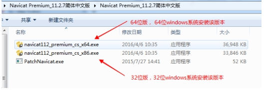


3) 安装 --- 傻瓜操作

注意： **安装路径不能有中文**

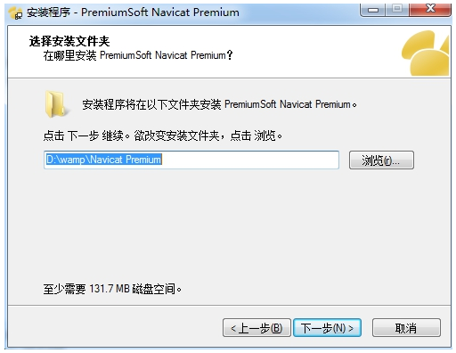

4) 安装完成后会在桌面上产生该图标

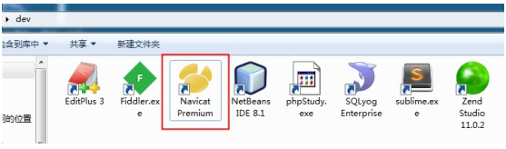

破解

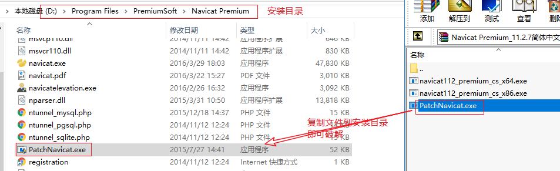

5) 使用客户端链接MySQL服务器

① 点击“链接”按钮 ---  选择要链接的数据库种类

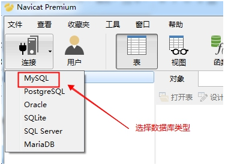

 ② 配置链接信息

   用户名： root          该用户是MySQL服务器系统的最高用户，拥有该系统的所有权限
   密码：  root             phpstudy中MySQL系统root用户的默认密码

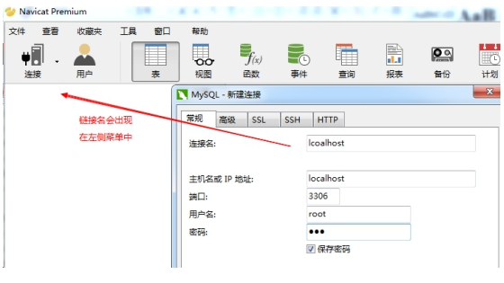

**保存**


  ③ 上图的连接名称是localhost，所以这里点击“localhost”结果

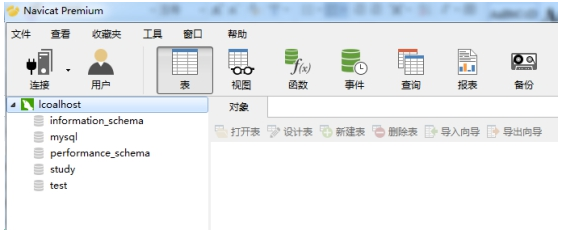

 

左侧的localhost下的内容都是数据库名称。

  ==information_schema、mysql、performance_schema 这三个是系统数据库（千万别动）==。
  其他的都是自建数据库

看到上图，说明已经使用navicat 客户端正常链接到了 MySQL服务器了。

# 2. 使用navicat创建数据库

在 'localhost' 上点击鼠标右键， 选择 '新建数据库'

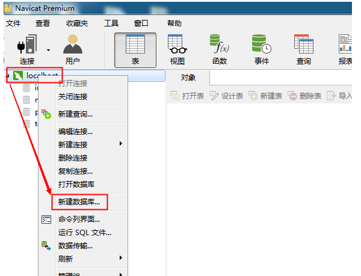

 

填写数据库名称 和 字符集（建议设置，也可以不设置）

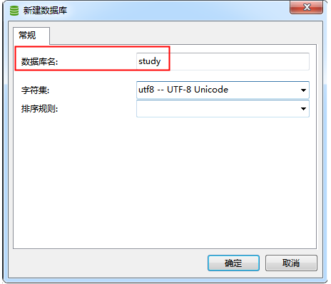

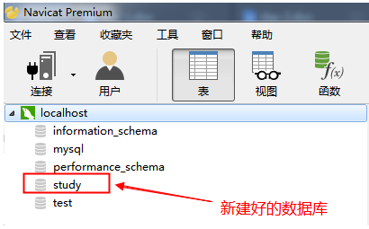


# 3. 使用navicat创建数据表

双击 'study' --->  '表'（右键） --->  '新建表'

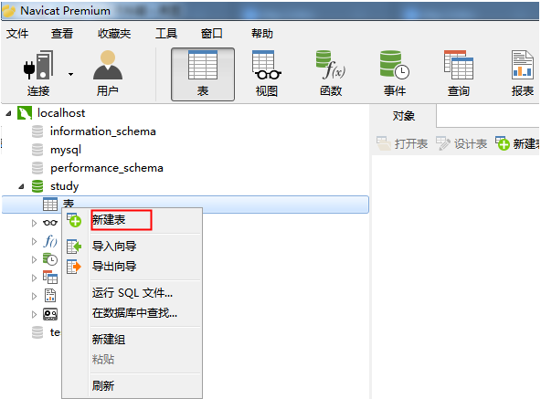


设置数据表的字段名、数据类型


设置几个字段

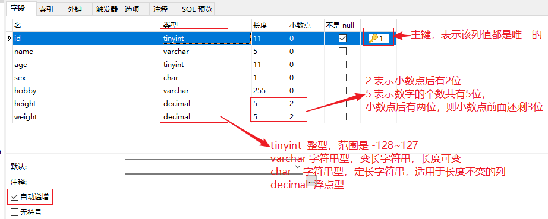

- id 学号，唯一
- name  姓名
- age  年龄
- sex 性别
- hobby 爱好
- height 身高
- weight 体重

主键： 有两个特点（唯一，非空），能够定位到唯一的一行数据

自动递增： 数字自增长

保存后使用F5刷新，能够看到新建好的表

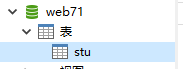

下面添加一些数据：

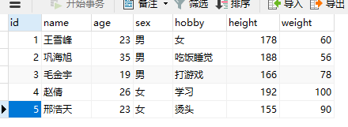


# SQL语句

 使用SQL语句就能很方便对数据库进行增删改查操作


# 4. 数据查询

语法格式: 

SELECT  字段名1, 字段名2, .....  FROM 表名	

​     [ WHERE <条件表达式> ]

​     [ ORDER BY <字段名> [ ASC|DESC ]]

​     [ LIMIT  START, LENGTH]  

 ```sql
# 基本的查询语法
# SELECT 字段1,字段2,... FROM 表名
SELECT id,name,age FROM stu
# 查询所有的字段
# SELECT * FROM 表名
SELECT * FROM stu
# 带条件的查询
SELECT * FROM 表名 WHERE 条件

....
 ```


## 4.1 基本查询

格式:  select  字段名1, 字段名2,....  from  表名 

 案例1: 查询所有学生的学号和姓名

 表 :  stu

 字段： id,  name

 

```sql
select id,name  from stu
```


 案例2: 查询学生的全部信息 (全部字段信息)

 表: stu

 字段:  id,name,age,sex,hobby,height,weight

​            *是通配符，代表所有的字段 

```sql
select * from stu
```


## 4.2 带where子句的查询

select  field1, field2... from 表名  查询表中的所有数据

  where 可以使用条件来筛选查询出的结果

 

 ```sql
-- select * from stu where 你的条件

-- 查询年龄大于20岁的同学
-- select * from stu where age > 20

-- 查询年龄大于20岁的男同学(判断相等用一个等号，字符串要加引号)
-- select * from stu where age > 20 and sex='男'

-- 查询年龄小于20岁的同学或者所有的女同学
-- select * from stu where age < 20 or sex='女'

-- 查询年龄在20到30岁之间的同学（包括20和30）
-- select * from stu where age >= 20 and age <= 30
select * from stu where age between 20 and 30
 ```


案例3: 查询学号为2的学生的所有信息

表： stu

字段： 所有字段  *

筛选条件：  id=2

```sql
select * from stu where id = 2
# 相等判断，写一个等号
```


案例4: 查询年龄大于等于25的学生的学号、姓名、年龄

表： stu

字段： id,name,age

筛选条件： age>=25

```sql
select id,name,age from stu where age >= 25
```


案例5: 查询年龄在23-28之间的学生的所有信息

表： stu

字段： *

筛选条件： 

```sql
select * from stu where age >= 23 and age <= 28

select * from stu where age between 23 and 28
```


## 4.3 模糊查询

通配符:

  %: 代表任意长度(包括0)的任意字符

  _:  代表1位长度的任意字符

```
a%b :  ab  abb  asdfb
a_b: acb  atb 
a_b%:  acb  a&baaad

```

like: 在执行模糊查询时，必须使用like来作为匹配条件

```sql
-- 查询名字中第一个字是 “王” 的同学
-- select * from stu where name like '王%'

-- 查询名字第一个字是 “王” ，但是名字只有两个字
-- select * from stu where name like '王_'

-- 查询名字中包含有 “王” 的同学
select * from stu where name like '%王%';
```


## 4.4 查询结果排序

order by 可以对查询结果按某个字段进行升序或者降序排列

  升序 asc （默认值） ，  降序 desc 

可进行排序的字段通常是  整型  英文字符串型  日期型  (中文字符串也行,但一般不用)

```sql
-- 查询所有的学生，按添加先后顺序，降序排列
-- select * from stu order by id desc

-- 查询所有的学生，按id升序排序
-- select * from stu order by id asc
-- select * from stu order by id

-- 查询学生，按年龄降序排列
-- select * from stu order by age desc

-- 查询学生，按年龄降序排序，如果年龄相同，则按身高升序排序
-- select * from stu order by age desc, height asc

-- 查询年龄大于25的同学，并按年龄升序排序
select * from stu where age > 25 order by age

```

**==注意：如果SQL语句中，有where和order by，where一定要放到order by之前==**。


## 4.5 限制查询结果

limit 用来限制查询结果的起始点和长度

 格式:  limit  start, length

 start: 起始点。 查询结果的索引，从0开始。 0代表第一条数据。如果省略start，则默认表示从0开始

 length: 长度

```sql
-- 查询前三名同学
-- select * from stu limit 0, 3
-- select * from stu limit 3

-- 查询第4/5/6 三名同学
-- select * from stu limit 3, 3

-- 查询年龄最大的三名同学
-- select * from stu order by age desc limit 3

-- 查询 名字 以“王”开头，的年龄最大的1名同学
select * from stu where name like '王%' order by age desc limit 1
```

**==注意：where、order by、limit如果一起使用，是有顺序的，where在最前面、其次是order by、limit要放到最后==。**

# 5. 添加数据

格式:  insert into 表名(字段名1，字段名2,....)  values (值1，值2，....)

 注意: ==字段的顺序要和值的顺序是完全匹配的==
          ==自增长类型的主键，可以使用null来填充；MySQL会自动填充数据==
          ==如果每个字段都有数据，那么表名后面可以不跟字段名，但是values里面的顺序必须正确==

 

案例: 向stu表中添加一条数据

方式一：指定字段和值，只要字段和值对应即可。和顺序无关

```sql
insert into stu (sex, weight, name) values ('男', 60, '王晨')
```


方式二：和顺序有关，因为没指定字段，所以值必须是所有的值，而且顺序和表中字段的顺序要一致

```sql
insert into stu values (null, '老汤', 23, '男', '打游戏,打球,打人', 176, 72)
```


方式三：使用set里设置新数据的值，没有顺序关系

```sql
insert into stu set weight=80, name='左金城', age=31 
```


# 6. 修改数据

格式:  

  update  表名   set   字段1=值1, 字段2=值2,...  where  ==修改条件==

  修改表中的哪一条（几条）数据的 字段1=值1...

 ==不指定修改条件会修改所有的数据==

```sql
-- 更新所有的体重为60（危险操作）
-- update stu set weight=60

-- 更新id为1的同学的年龄为24岁
-- update stu set age = 24 where id = 1

-- 更新id大于8的同学的年龄为30，体重为50
update stu set age=30, weight=50 where id > 8

```


# 7. 删除数据

格式:  delete  from 表名  where ==删除条件==

 ==注意：不指定条件将删除所有数据==

```sql
-- 删除id大于10的同学
-- delete from stu where id > 10

-- 不加条件，全部删除了
delete from stu
```


> drop table stu; -- 删除stu表
>
>  -- 删除库，加入反引号可以防止出现问题，否则MySQL可能会将70当做关键字或其他意思解释


# 8. node中的mysql模块

## 8.1 mysql模块的作用

mysql模块是一个第三方模块，专门用来操作MySQL数据库。 可以执行增删改查操作。

```shell
# 如果前面没有安装过其他模块，需要先初始化
npm i mysql
```


curd: 就代表数据库的增删改查

c: create 就是添加 （增）

u: update 就是修改 （改）

r: read 就是查询 （查）

d: delete 就是删除 （删）


## 8.2 mysql基本用法

在Node中使用MySQL模块一共需要5个步骤：

1) 加载 MySQL 模块

2) 创建 MySQL 连接对象

3) 连接 MySQL 服务器

4) 执行SQL语句           

5) 关闭链接                

```js
//目标: 将student表中所有的数据查询出来并显示到终端

//1. 加载 mysql 模块
const mysql = require('mysql');

//2. 创建mysql链接对象
const conn = mysql.createConnection({
    host: 'localhost',  //指定mysql服务器的ip地址
    port: 3306,         // 苹果电脑MySQL端口是8888
    user: 'root',       //设置用户名
    password: 'root',   //用户名对应的密码
    database: 'web70'
});

//3. 链接mysql服务器
conn.connect();

//4. 执行SQL语句
const sql = 'select * from student';
/**
 * query方法的功能：执行SQL语句
 * 参数1: 要执行的SQL语句
 * 参数2: 占位符所对应的数据，可选
 * 参数3: 当SQL执行完成后触发的回调函数，有三个参数
 *    err: 错误对象。如果SQL执行失败，err就是错误信息的对象；如果执行成功则为null
 *    results: SQL执行的结果
 *    fields: 本次SQL执行涉及到的字段信息
 */
//当执行查询的SQL语句时，返回值一定一个数组；数组内部是对象；
//对象的下标是 数据表的字段名
//results = [
// {sno:1, sname:"葛小伦", snickname:"gxl", sage:28, sgender:"男", stime:"2019-01-10", sdept:1},
// {sno:2, sname:"蔷薇", snickname:"gw", sage:200, sgender:"女", stime:"2019-01-11", sdept:3},
// ...
//]
conn.query(sql, (err, results, fields) => {
    console.log(err);
    console.log(results);
    console.log(fields); //一般用不上，可以不写
})

//5. 关闭链接
conn.end();
```


## 8.3 查询 --- read

==执行查询类型的SQL语句，查询结果（result）是一个数组，每个单元是对象，对象的属性是数据表的字段名==

```js
//目标: 将student表中所有的数据查询出来并显示到终端

//1. 加载 mysql 模块
const mysql = require('mysql');

//2. 创建mysql链接对象
const conn = mysql.createConnection({
    host: '127.0.0.1',  //指定mysql服务器的ip地址
    user: 'root',       //设置用户名
    password: 'root',   //用户名对应的密码
    database: 'study'
});

//3. 链接mysql服务器
conn.connect();

//4. 执行SQL语句
const sql = 'select * from student';
/**
 * query方法的功能：执行SQL语句
 * 参数1: 要执行的SQL语句
 * 参数2: 占位符所对应的数据，可选
 * 参数3: 当SQL执行完成后触发的回调函数，有三个参数
 *    err: 错误对象。如果SQL执行失败，err就是错误信息的对象；如果执行成功则为null
 *    results: SQL执行的结果
 *    fields: 本次SQL执行涉及到的字段信息
 */
//当执行查询的SQL语句时，返回值一定一个数组；数组内部是对象；
//对象的下标是 数据表的字段名
//results = [
// {sno:1, sname:"葛小伦", snickname:"gxl", sage:28, sgender:"男", stime:"2019-01-10", sdept:1},
// {sno:2, sname:"蔷薇", snickname:"gw", sage:200, sgender:"女", stime:"2019-01-11", sdept:3},
// ...
//]
conn.query(sql, (err, results, fields) => {
    console.log(err);
    console.log(results);
    console.log(fields); //一般用不上，可以不写
})

//5. 关闭链接
conn.end();
```


占位符模式：


当SQL语句中使用了占位符，则query方法需要使用参数2

```js
// 查询所有的男性学生信息并显示到终端

//1. 加载mysql模块
const mysql = require('mysql');

//2. 创建mysql链接对象
const conn = mysql.createConnection({
    host: '127.0.0.1',
    user: 'root',
    password: 'root',
    database: 'study',
    port: 3306  // 设置mysql服务器的端口号，默认的3306可以省略
});

//3. 链接mysql服务器
conn.connect();

//4. 执行SQL语句
//在sql语句中出现的 ? 就是占位符
const sql = 'select * from student where sgender=?';
//当sql语句中有？时，就使用参数2来设置占位符代表的具体值
conn.query(sql, "男", (err, result) => {
    if (err) {
        return console.log(err);
    }

    console.log(result);
})

//5. 关闭链接
conn.end();
```

如果SQL中有多个占位符，则传递数组

```js
let sql = 'select * from student where sage > ? or sgender = ?';
conn.query(sql, [20, '男'], (err, result) => {
    if (err) throw err;
    console.log(result);
}); 
```


## 8.4 添加 --- create

==执行添加类型的SQL语句，查询结果（result）是一个对象，该对象中有两个属性需要记住==

- affectedRows： 受影响行数
- insertID： 查询数据的主键值


```js
//目标：向student表中添加一条数据

const mysql = require('mysql');
const conn = mysql.createConnection({
    host: '127.0.0.1',
    user: 'root',
    password: 'root',
    database: 'study'
});
conn.connect();

//4. 执行SQL语句
let sql = "insert into student(sname, sage) values ('马大帅', 36)";
//当执行添加的SQL语句时，返回值是一个对象，在该对象中有两个属性需要记住
// affectedRows: 受影响函数
// insertId: 添加的新数据的主键值，此处就是 sno
conn.query(sql, (err, result) => {
    if (err) {
        return console.log(err);
    }

    console.log(result);
})

//5. 关闭链接
conn.end();
```

查询结果：


占位符形式：

  数据添加时，占位符需要一个对象。 对象的属性是数据表字段名，值是要写入数据表的数据

```js
//目标: 向student表添加一条数据

//1. 加载mysql模块
const mysql = require('mysql');

//2. 创建mysql链接对象
const conn = mysql.createConnection({
    host: '127.0.0.1',
    user: 'root',
    password: 'root',
    database: 'study',
    port: 3306  // 设置mysql服务器的端口号，默认的3306可以省略
});

//3. 链接mysql服务器
conn.connect();

//4. 执行SQL语句
const sql = "insert into student set ?";
//当执行添加的SQL语句中有占位符，那么该占位符需要一个对象来填充
//该对象下标是数据表的字段名，自增长的主键不需要写
const obj = {
    sname: "嗯嗯嗯",
    snickname: "enenen",
    sage: 20,
    sgender: "男",
    stime: "2019-02-18",
};

conn.query(sql, obj, (err, result) => {
    if (err) {
        return console.log(err);
    }

    console.log(result);
})

//5. 关闭链接
conn.end();
```


## 8.5 修改 --- update

==执行修改类型的SQL语句，查询结果（result）是一个对象，该对象中有 affectedRows 属性==

```js
//目标: 将学号为6的学生姓名改为初音未来，性别改为男

//1. 加载mysql模块
const mysql = require('mysql');

//2. 创建mysql链接对象
const conn = mysql.createConnection({
    host: '127.0.0.1',
    user: 'root',
    password: 'root',
    database: 'study',
    port: 3306  // 设置mysql服务器的端口号，默认的3306可以省略
});

//3. 链接mysql服务器
conn.connect();

//4. 执行SQL语句
const sql = "update student set sname='初音未来',sgender='男' where sno=6";
conn.query(sql, (err, result) => {
    if (err) {
        return console.log(err);
    }

    console.log(result);
})

//5. 关闭链接
conn.end();
```


占位符模式：

  数据修改通常需要两个占位符。 占位符1是要修改的数据，对象形式，属性是数据表字段；占位符2是修改条件，通常是主键值

```js
//目标: 将学号为6的学生姓名改为初音未来，性别改为男

//1. 加载mysql模块
const mysql = require('mysql');

//2. 创建mysql链接对象
const conn = mysql.createConnection({
    host: '127.0.0.1',
    user: 'root',
    password: 'root',
    database: 'study',
    port: 3306  // 设置mysql服务器的端口号，默认的3306可以省略
});

//3. 链接mysql服务器
conn.connect();

//4. 执行SQL语句 --- 占位符形式
const sql = "update student set ? where sno=?";
//set 之后是要修改的数据，需要使用对象形式，下标是数据表的字段名
const obj = {
    sname: "未来战士",
    sgender: "女",
    sage: 20
}
const sno = 7;
//当sql语句中出现多个占位符时，参数可以使用数组来设置
//数组中的单元会按照顺序填充到sql语句的？位置
conn.query(sql, [obj, sno], (err, result) => {
    if (err) {
        return console.log(err);
    }

    console.log(result);
})

//5. 关闭链接
conn.end();
```


## 8.6 删除 --- delete

==执行删除类型的SQL语句，查询结果（result）是一个对象，该对象中有 affectedRows 属性==

```js
//目标: 将学号为6的学生删除

//1. 加载mysql模块
const mysql = require('mysql');

//2. 创建mysql链接对象
const conn = mysql.createConnection({
    host: '127.0.0.1',
    user: 'root',
    password: 'root',
    database: 'study',
    port: 3306  // 设置mysql服务器的端口号，默认的3306可以省略
});

//3. 链接mysql服务器
conn.connect();

//4. 执行SQL语句
const sql = 'delete from student where sno=6';
conn.query(sql, (err, result) => {
    if (err) {
        return console.log(err);
    }

    console.log(result);
})

//5. 关闭链接
conn.end();
```


占位符模式：

```js
//目标: 将学号为6的学生删除

//1. 加载mysql模块
const mysql = require('mysql');

//2. 创建mysql链接对象
const conn = mysql.createConnection({
    host: '127.0.0.1',
    user: 'root',
    password: 'root',
    database: 'study',
    port: 3306  // 设置mysql服务器的端口号，默认的3306可以省略
});

//3. 链接mysql服务器
conn.connect();

//4. 执行SQL语句 --- 占位符形式
const sql = 'delete from student where sno=?';
conn.query(sql, 7, (err, result) => {
    if (err) {
        return console.log(err);
    }

    console.log(result);
}) 


//5. 关闭链接
conn.end();
```


# 9. Node中的模块化

## 9.1 什么是模块化

- js设计之初只是为了实现表单验证这样的简单功能，没设计模块化方案，所以js天生不支持模块化
- 不支持模块化简单来说就是在一个js文件内不能引入其他js文件
- 为了让js支持模块化，一些大神自己编写底层库文件，让js开始支持模块化
- js模块化规范有四种标准： AMD   CMD   **CommonJS**   ES6
- Node属于CommonJS标准
- 使用模块化可以很好的解决变量、函数名冲突问题，也能灵活的解决文件依赖问题

- 没有模块化，不允许一个js文件引入另外的JS，有了模块化，就允许一个js文件引入其他的js文件

## 9.2 全局作用域和局部作用域

局部作用域（模块的作用域）：

- 一个js文件就是一个模块
- 在一个js文件中定义的属性（变量、常量）和方法默认都只能在当前js文件中使用


案例： 创建index.js、user.js两个模块。 user.js 模块中定义属性和方法，index.js导入user.js模块

导入之后，输出user，并不能得到user中的变量、常量等。

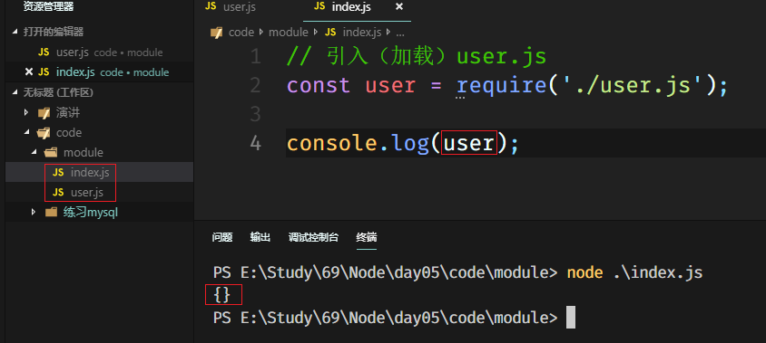

全局作用域：

- 在js文件中声明的属性和方法如果都挂载到global对象下；当其他js文件导入该模块后，就能使用该模块下的属性和方法了。 


案例： 创建index.js、game.js两个模块。 game.js 模块中定义属性和方法并挂载到global对象下，index.js导入game.js模块

user.js

```js
global.username = 'zs';
global.age = 20;
global.t = function () {
    console.log(123);
}
```

index.js

```js
// 引入（加载）user.js
const user = require('./user.js');

console.log(global.username); // zs
```

这样可以实现模块化，但是不好。可能会污染（覆盖原有的变量）全局变量

## 9.3 module.exports导出属性和方法

- 将变量、对象、函数等挂载到global对象上并不推荐，因为容易造成变量污染。
- 推荐使用 module.exports 导出模块中定义好的变量、对象、方法
- 使用require加载（导入）模块后，就能使用模块中定义好的变量、对象、方法了


案例: user.js中定义变量、对象、方法，最后使用 module.exports 导出

```js
let username = 'lisi';

let age = 30;

function abcd () {
    console.log(1234);
}

// 使用Node提供的导出模块的方法
// module.exports = {
//     username: username,
//     age: age,
//     abcd: abcd
// };
// ES6 新语法，对象中属性名和变量名一样，可以省略 “:value”
// 具体写法如下
module.exports = {
    username,
    age,
    abcd
};
```


## 9.4 封装 db.js 模块

核心思想： mysql操作流程是固定的，尤其是前三步。将前三部封装到一个模块，导出链接对象。 链接对象就可以调用query方法执行sql语句，也能执行end方法关闭链接


在其他需要进行数据库操作的文件中加载 db.js 模块

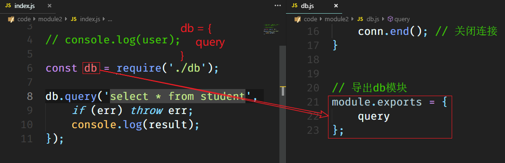

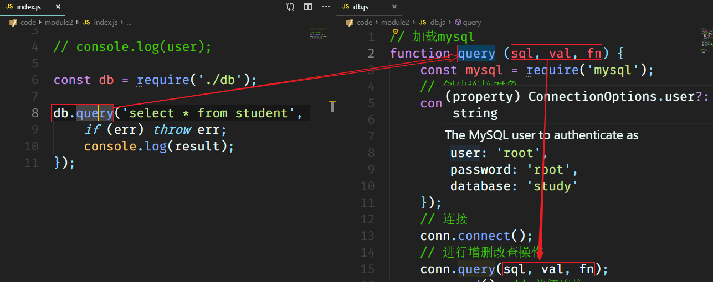


